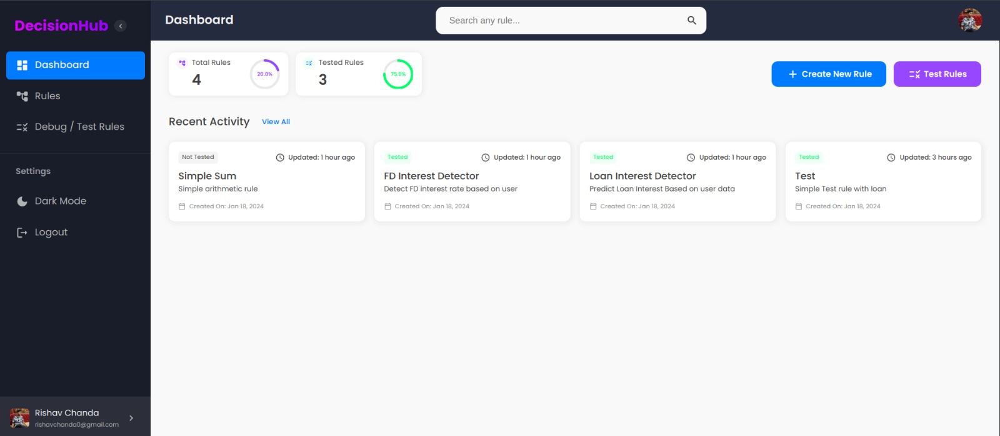
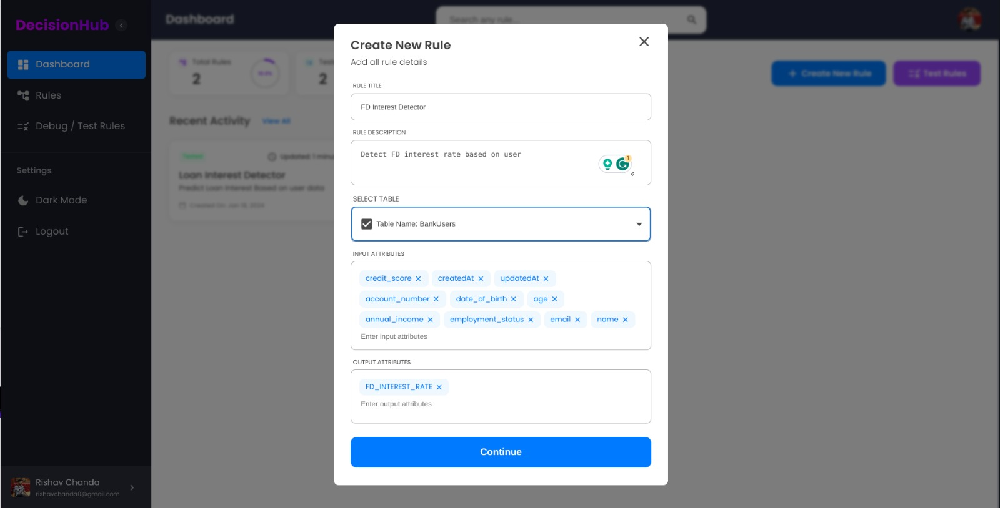
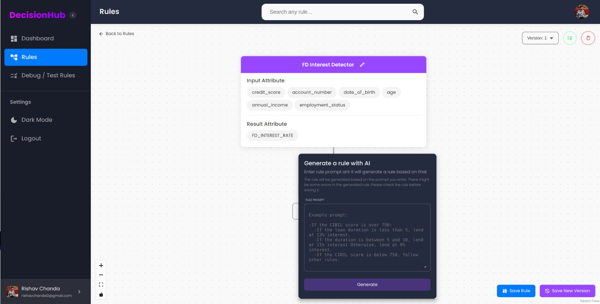
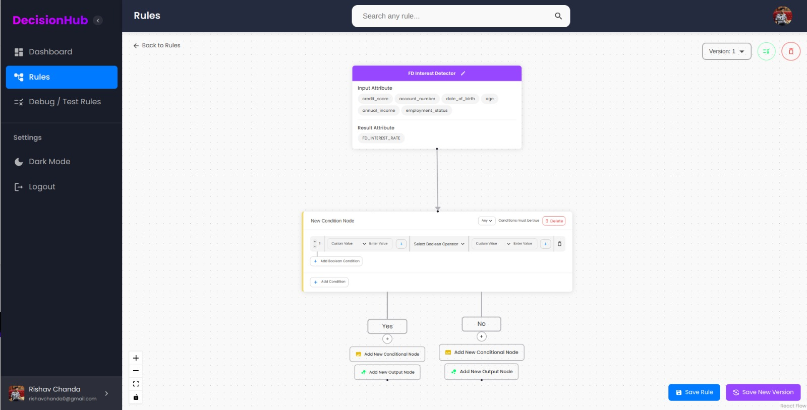
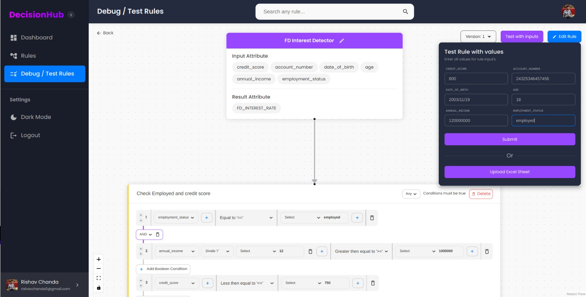
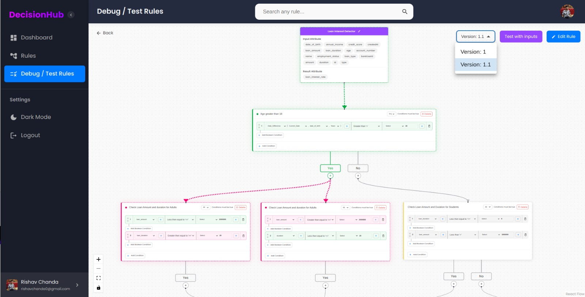
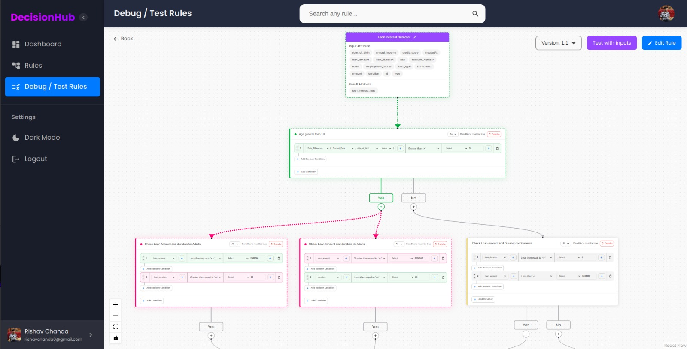
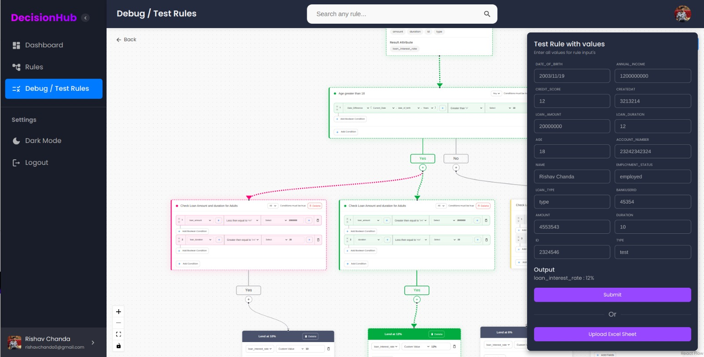
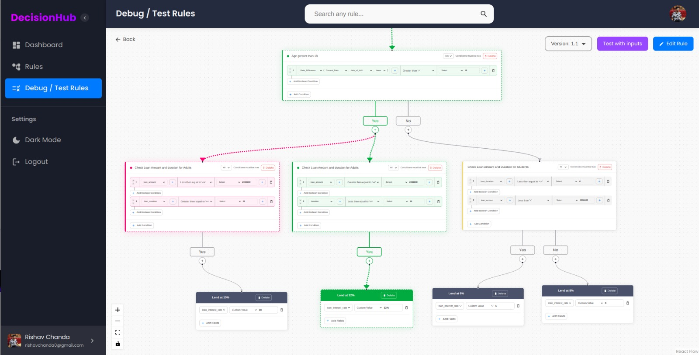
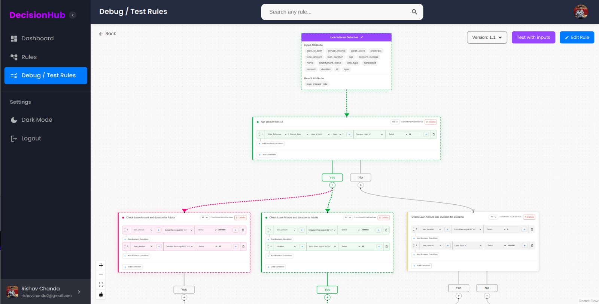

# DecisionHub

A Rule Builder application “Decision Hub” that empowers Business Analysts to create, save, and visualize decision strategies. Provide a no-code rule writing experience and visual representation to test these rules in real-time and observe the calculations at each step.

#### Web Link: https://decisionhub.netlify.app/

| Dashboard                         |
| --------------------------------- |
|  |

| Rules                          |
| ------------------------------ |
|  |
|  |
|   |

| Debug / Test Rules                 |
| ---------------------------------- |
|    |
|   |
|   |
|   |
|   |
|  |
|  |

## Features

- User Authentication:
  - Users can login to the service using their emails or using Google Accounts
- Rules Management:
  - Add Rules : Users can create rules for more than one database, including rule description, input attributes, output attributes
  - Create Conditions : Users can either create conditions or generate one using AI for a rule
  - Versions : Users can store multiple versions of a rule
- AI:
  - Leverages the power of AI to create rules based on User prompt
- Debug and Testing
  - Debug & Testing : User can debug and test rule with various input to get the desired result.
- Graphical Information:
  - Tree : A tree like rule creation such that, visualisation of rules is easier

## Getting Started

### Pre-requisites

1. Create a [Render](https://dashboard.render.com/) account and set up a new PostgreSQL database.

### Clone the repository

1. Clone the repository: `git clone https://github.com/rishavchanda/DecisionHub.git`

### Configure the client

1. Navigate to client folder: `cd client`
2. Install required packages: `npm i`

### Configure the server

1. Navigate to server folder: `cd server`
2. Install required packages: `npm i`
3. Set up the database and configure the environment variables by following the instructions in the next steps.

### Set up the database

1. Create a Render Account and Create new PostgreSQL database
2. Create a `.env` file in the server folder and add the following environment variables:

```
PORT= <port_to_run_node_server>
DATABASE_URL= <postgres_connection_string>
JWT= <JWT_secret>
EMAIL_USERNAME= <decision_hub_gmail_username>
EMAIL_PASSWORD= <decision_hub_gmail_password>
OPENAI_API_KEY= <openai_api_key>
```

### Run the application

#### Run the client

1. Navigate to server folder: `cd client`
2. Start Client : `npm start`
3. Open the application in your browser at `http://localhost:3000`

#### Run the server

1. Navigate to server folder: `cd server`
2. Start Client : `npm start`
3. Server will be running at `http://localhost:8080`

## Technologies Used

- Front-End: React.js, HTML, CSS, JavaScript, Redux, React Flow
- Back-End: Node.js, Express.js, JWT
- Database: PostgreSQL

## Contributing

We welcome contributions from the community to enhance DecisionHub. Feel free to submit bug reports, feature requests, or pull requests through the GitHub repository.

## License

This project is licensed under the [MIT License](https://opensource.org/licenses/MIT).

## Contact

For any questions or inquiries, please reach out to the development team at [DecisionHub](mailto:decisionhub629@gmail.com)

Enjoy using DecisionHub and stay productive!
